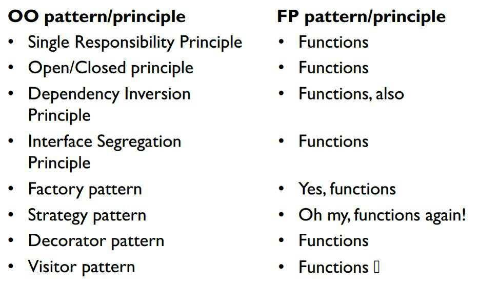

---
title: Functional VS OO
author: Adi Iyengar
patat:
    incrementalLists: true
    theme:
        emph: [vividWhite, onVividBlack, bold]
        imageTarget: [onDullWhite, vividRed]
...

# TITLE
```
λ vs OO

```



# A BRIEF HISTORY

- Entscheidungsproblem (Decision Problem), by David Hilbert

- Alonso Church
    * Lambda Calculus
- Alan Turing
    * The Turing Machine


# RESOURCES

- Mostly experience with different programming languages and blogs

- Books:
  > Design Concepts in Programming Languages
  > Real World Haskell
  > Functional Thinking


# TOPICS

- Basics of OO and Functional paradigms
- Differences between OO and Functional
- What do I like better?
- Q&A / Discussion


# OBJECT ORIENTED PROGRAMMING PARADIGM

- In OO, we break programs into classes/modules/boundaries that give behavior to a set of data.

- Usually has some vertical and horizontal reuse features.

- Abstraction, Inheritance, Encapsulation, Polymorphism

- Stateful


# FUNCTIONAL PROGRAMMING PARADIGM

- In functional paradigm, we break programs into functions that perform specific operations.

- In FP, functions as first-class "objects".

- Stateless*

- Pure FP is side-effect-free programming.

- In pure FP, everything is an expression


# OBJECT ORIENTED VS FUNCTIONAL

| OO                                         | λ                                     |
|:-------------------------------------------|:--------------------------------------|
| Nouns (Abstraction, Inheritance)           | Verbs (Composition)                   |
| Data coupled with Behavior                 | Data is separate from behavior        |
| Usually more reusable                      | Usually more verbose                  |
| Usually mutable                            | Usually immutable                     |
| Turing Completedness                       | Lambda Calculus                       |


# OTHER PARADIGMS

> Procedural
> Symbolic
> Logical
> Imperative
> Declarative
> Esolangs

# WHAT DO I LIKE BETTER

- Explicitness
  >> No Dynamic Dispatch code smell
  >> Side-effect free code
  >> Referential Transparency

- Horizontally Scalable Concurrency
  >> Immutability
  >> Statelessness
  >> Best Concurrency models

- Fun to code
  >> Code as you think..
  >> Intuitive (personal preference)
  >> Very mathematical
  >> Composition & Currying
  >> Lazy Evaluation
  >> Great compilers

- Maximizes Rewritability
  >> Rewritability Paradox!

- Communities
  >> Great maintainers
  >> Generally more intellectual people (personal experience)

- Haskell!
  >> Purely Functional
  >> Pattern Matching
  >> Pipe Operator
  >> Parameteric Polymorphism
  >> Exception Handling
  >> Static Typing
  >> Eager Evaluation
  >> Lazy evaluation through closures
  >> High-level, yet super fast (GHC)

- __Joe Armstrong__ said:
_The problem with object-oriented languages is they've got all this implicit environment that they carry around with them. You wanted a banana but what you got was a gorilla holding the banana and the entire jungle._


# QUESTIONS?
